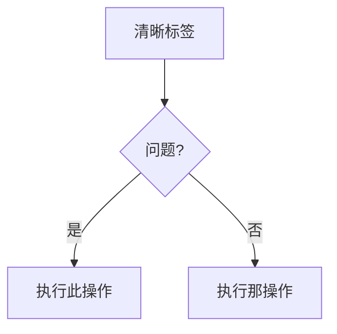

# BMAD 技术文档标准

**目标 Agent：技术文档编写者**
**目的：文档创建和审查的简明参考**

---

## 关键规则

### 规则 1：严格遵守 CommonMark

所有文档必须完全遵循 CommonMark 规范。无例外。

### 规则 2：禁止时间估算

永远不要在文档中记录任何工作流、任务或活动的时间估算、持续时间或完成时间。这包括：

- 工作流执行时间（例如 "30-60 分钟"、"2-8 小时"）
- 任务持续时间估算
- 阅读时间估算
- 实现时间范围
- 任何时间性度量

时间会因以下因素显著变化：

- 项目复杂度
- 团队经验
- 工具和环境
- 上下文切换
- 意外阻碍

**替代方案：** 专注于工作流步骤、依赖关系和输出。让用户自行确定时间线。

### CommonMark 要点

**标题：**

- 仅使用 ATX 风格：`#` `##` `###`（不使用 Setext 下划线）
- `#` 后单个空格：`# 标题`（不是 `#标题`）
- 无尾部 `#`：`# 标题`（不是 `# 标题 #`）
- 层级顺序：不跳级（h1→h2→h3，不是 h1→h3）

**代码块：**

- 使用带语言标识符的围栏代码块：
  ````markdown
  ```javascript
  const example = 'code';
  ```
  ````
- 不使用缩进代码块（有歧义）

**列表：**

- 列表内标记一致：全部 `-` 或全部 `*` 或全部 `+`（不混用）
- 嵌套项正确缩进（2 或 4 个空格，保持一致）
- 列表前后空行以提高清晰度

**链接：**

- 内联：`[文本](url)`
- 引用：`[文本][ref]` 然后在底部 `[ref]: url`
- 裸 URL 必须用 `<>` 括起来

**强调：**

- 斜体：`*文本*` 或 `_文本_`
- 粗体：`**文本**` 或 `__文本__`
- 文档内风格一致

**换行：**

- 行尾两个空格 + 换行符，或
- 段落间空行
- 不使用单行换行（会被忽略）

---

## Mermaid 图表：需要有效语法

**关键规则：**

1. 始终在第一行指定图表类型
2. 使用有效的 Mermaid v10+ 语法
3. 输出前测试语法（心理验证）
4. 保持专注：理想 5-10 个节点，最多 15 个

**图表类型选择：**

- **flowchart** - 流程图、决策树、工作流
- **sequenceDiagram** - API 交互、消息流、基于时间的过程
- **classDiagram** - 对象模型、类关系、系统结构
- **erDiagram** - 数据库模式、实体关系
- **stateDiagram-v2** - 状态机、生命周期阶段
- **gitGraph** - 分支策略、版本控制流

**格式：**

````markdown

````

---

## 样式指南原则（精华）

按以下层级应用：

1. **项目特定指南**（如存在）- 始终先询问
2. **BMAD 约定**（本文档）
3. **Google 开发者文档风格**（下方默认值）
4. **CommonMark 规范**（有疑问时）

### 核心写作规则

**任务导向：**

- 为用户目标而写，而非功能列表
- 从为什么开始，然后是如何
- 每个文档回答："我能完成什么？"

**清晰原则：**

- 主动语态："点击按钮" 而非 "按钮应该被点击"
- 现在时态："函数返回" 而非 "函数将返回"
- 直接语言："使用 X 来做 Y" 而非 "X 可以用于 Y"
- 第二人称："你配置" 而非 "用户配置" 或 "一个人配置"

**结构：**

- 每句一个想法
- 每段一个主题
- 标题准确描述内容
- 示例跟随解释

**可访问性：**

- 描述性链接文本："查看 API 参考" 而非 "点击这里"
- 图表的替代文本：描述它显示什么
- 语义标题层级（不跳级）
- 表格有标题
- 如果用户偏好允许，可以使用表情符号（现代无障碍工具对表情符号支持良好）

---

## OpenAPI/API 文档

**必需元素：**

- 端点路径和方法
- 身份验证要求
- 请求参数（路径、查询、正文）及类型
- 请求示例（真实、可用）
- 响应模式及类型
- 响应示例（成功 + 常见错误）
- 错误代码和含义

**质量标准：**

- 符合 OpenAPI 3.0+ 规范
- 完整模式（无缺失字段）
- 可实际工作的示例
- 清晰的错误消息
- 记录安全方案

---

## 文档类型：快速参考

**README：**

- 是什么（概述）、为什么（目的）、如何（快速开始）
- 安装、使用、贡献、许可证
- 少于 500 行（链接到详细文档）

**API 参考：**

- 完整的端点覆盖
- 请求/响应示例
- 身份验证详情
- 错误处理
- 速率限制（如适用）

**用户指南：**

- 基于任务的章节（如何...）
- 分步说明
- 有用的截图/图表
- 故障排除部分

**架构文档：**

- 系统概览图（Mermaid）
- 组件描述
- 数据流
- 技术决策（ADR）
- 部署架构

**开发者指南：**

- 设置/环境要求
- 代码组织
- 开发工作流
- 测试方法
- 贡献指南

---

## 质量检查清单

在完成任何文档之前：

- [ ] 符合 CommonMark（无违规）
- [ ] 任何地方都没有时间估算（关键规则 2）
- [ ] 标题层级正确
- [ ] 所有代码块都有语言标签
- [ ] 链接有效且有描述性文本
- [ ] Mermaid 图表正确渲染
- [ ] 主动语态、现在时态
- [ ] 任务导向（回答 "我如何..."）
- [ ] 示例具体且可用
- [ ] 符合无障碍标准
- [ ] 拼写/语法检查
- [ ] 在目标技能水平下阅读清晰

---

## BMAD 特定约定

**文件组织：**

- 每个主要组件根目录有 `README.md`
- 广泛文档放在 `docs/` 文件夹
- 工作流特定文档在工作流文件夹中
- 交叉引用使用相对路径

**Frontmatter：**
适当时使用 YAML frontmatter：

```yaml
---
title: 文档标题
description: 简要描述
author: 作者名称
date: YYYY-MM-DD
---
```

**元数据：**

- 始终包含最后更新日期
- 版本化文档的版本信息
- 作者归属以确保问责

---

**记住：这是你的基础。始终遵循这些规则，所有文档将清晰、可访问且易于维护。**
