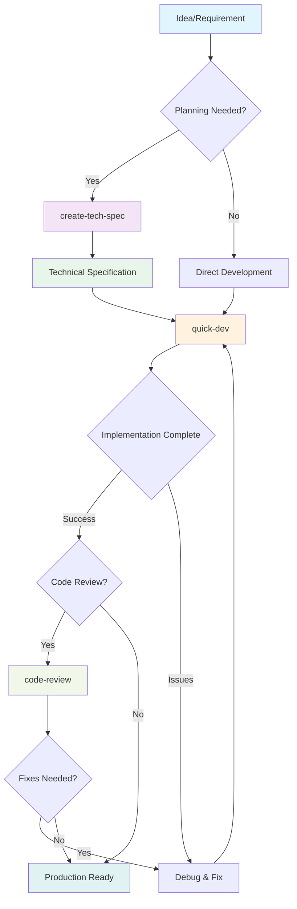
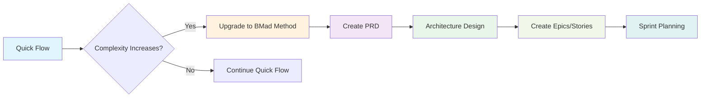

# BMAD 快速流程

**路线：** 快速流程
**主要代理：** 快速流程单人开发者 (Barry)
**理想适用于：** Bug修复、小功能、快速原型开发

---

## 概述

BMAD快速流程是BMAD方法生态系统中从想法到生产最快路径。这是一个为快速开发而设计的精简3步流程，同时不牺牲质量。适用于需要快速行动的有经验团队或不需要大量规划的小型功能。

### 何时使用快速流程

**非常适合：**

- Bug修复和补丁
- 小功能添加（1-3天工作量）
- 概念验证和原型
- 性能优化
- API端点添加
- UI组件增强
- 配置更改
- 内部工具

**不推荐用于：**

- 大规模系统重新设计
- 复杂的多团队项目
- 新产品发布
- 需要大量UX设计的项目
- 企业级项目
- 有合规要求的关键任务系统

---

## 快速流程过程



### 步骤1：可选技术规范

`create-tech-spec` 工作流程将需求转换为实现就绪的规格说明。

**主要特点：**

- 对话式规格工程
- 自动代码库模式检测
- 从现有代码中收集上下文
- 实现就绪的任务分解
- 接受标准定义

**流程：**

1. **问题理解**
   - 问候用户并收集需求
   - 询问有关范围和限制的澄清问题
   - 检查现有项目上下文

2. **代码调查（棕地开发）**
   - 分析现有代码库模式
   - 记录技术栈和约定
   - 识别要修改的文件和依赖项

3. **规格生成**
   - 创建结构化技术规格
   - 定义明确的任务和接受标准
   - 记录技术决策
   - 包含开发上下文

4. **审查和最终确定**
   - 呈现规格以供验证
   - 根据需要进行调整
   - 保存到冲刺工件

**输出：** `{sprint_artifacts}/tech-spec-{slug}.md`

### 步骤2：开发

`quick-dev` 工作流程以灵活性和速度执行实现。

**两种执行模式：**

**模式A：技术规格驱动**

```bash
# 从技术规格执行
quick-dev tech-spec-feature-x.md
```

- 加载和解析技术规格
- 提取任务、上下文和接受标准
- 按顺序执行所有任务
- 完成时更新规格状态

**模式B：直接指令**

```bash
# 直接开发命令
quick-dev "向认证服务添加密码重置"
quick-dev "修复图像处理中的内存泄漏"
```

- 接受直接开发指令
- 提供可选规划步骤
- 以最小摩擦立即执行

**开发流程：**

1. **上下文加载**
   - 如果可用，加载项目上下文
   - 理解模式和约定
   - 识别相关文件和依赖项

2. **实现循环**
   对于每个任务：
   - 加载相关文件和上下文
   - 按照既定模式实现
   - 编写适当的测试
   - 运行并验证测试通过
   - 标记任务完成并继续

3. **连续执行**
   - 不停地处理所有任务
   - 通过请求指导处理故障
   - 确保测试通过后继续

4. **验证**
   - 确认所有任务完成
   - 验证接受标准
   - 如果使用，更新技术规格状态

### 步骤3：可选代码审查

`code-review` 工作流程为实现的代码提供高级开发人员审查。

**使用时机：**

- 生产关键功能
- 安全敏感的实现
- 性能优化
- 团队开发场景
- 学习和知识传递

**审查流程：**

1. 加载故事上下文和接受标准
2. 分析代码实现
3. 对照项目模式检查
4. 验证测试覆盖
5. 提供结构化审查注释
6. 如有需要建议改进

---

## 快速流程与其他路线比较

| 方面         | 快速流程     | BMad方法     | 企业方法     |
| ------------ | ------------ | ------------ | ------------ |
| **规划**     | 最小/可选    | 结构化       | 全面         |
| **文档**     | 仅必要       | 中等         | 广泛         |
| **团队规模** | 1-2名开发者  | 3-7名专家    | 8+企业团队   |
| **时间线**   | 几小时到几天 | 几周到几个月 | 几个月到季度 |
| **仪式**     | 最小         | 平衡         | 完整治理     |
| **灵活性**   | 高           | 中等         | 结构化       |
| **风险概览** | 中等         | 低           | 非常低       |

---

## 最佳实践

### 开始快速流程之前

1. **验证路线选择**
   - 功能是否足够小？
   - 有明确的需求吗？
   - 团队是否对快速开发感到舒适？

2. **准备上下文**
   - 准备好项目文档
   - 了解代码库模式
   - 提前识别受影响的组件

3. **设定明确边界**
   - 定义范围内的和范围外的项目
   - 建立接受标准
   - 识别依赖项

### 开发过程中

1. **保持速度**
   - 不要过度设计解决方案
   - 遵循现有模式
   - 使测试与风险成比例

2. **保持专注**
   - 阻止范围扩大
   - 如可能，稍后处理边缘情况
   - 简要记录决策

3. **沟通进度**
   - 定期更新任务状态
   - 立即标记阻碍
   - 与团队分享学习

### 完成后

1. **质量门**
   - 确保测试通过
   - 验证接受标准
   - 考虑可选代码审查

2. **知识转移**
   - 更新相关文档
   - 分享关键决策
   - 记下任何发现的模式

3. **生产就绪**
   - 验证部署要求
   - 检查监控需求
   - 规划回滚策略

---

## 快速流程模板

### 技术规格模板

```markdown
# 技术规格：{功能标题}

**创建日期：** {日期}
**状态：** 准备开发
**预估工作量：** 小（1-2天）

## 概述

### 问题陈述

{需要解决的清晰描述}

### 解决方案

{解决问题的高级方法}

### 范围（包含/排除）

**包含：** {将要实现的内容}
**排除：** {明确排除的项目}

## 开发上下文

### 代码库模式

{要遵循的关键模式、约定}

### 要参考的文件

{相关文件列表及其用途}

### 技术决策

{重要的技术选择和理由}

## 实施计划

### 任务

- [ ] 任务 1：{具体实施任务}
- [ ] 任务 2：{具体实施任务}
- [ ] 任务 3：{测试和验证}

### 接受标准

- [ ] 标准 1：{Given/When/Then 格式}
- [ ] 标准 2：{Given/When/Then 格式}

## 附加上下文

### 依赖项

{外部依赖或先决条件}

### 测试策略

{功能将如何测试}

### 注释

{附加考虑事项}
```

### 快速开发命令

```bash
# 从技术规格
quick-dev sprint-artifacts/tech-spec-user-auth.md

# 直接开发
quick-dev "向API端点添加CORS中间件"
quick-dev "修复用户服务中的空指针异常"
quick-dev "优化获取用户列表的数据库查询"

# 带可选规划
quick-dev "实现文件上传功能" --plan
```

---

## 与其他工作流程的集成

### 升级路线

如果快速流程功能的复杂性增加：



### 使用派对模式

对于复杂的快速流程挑战：

```bash
# 启动Barry
/bmad:bmm:agents:quick-flow-solo-dev

# 开始派对模式进行协作问题解决
party-mode
```

派对模式会引入相关专家：

- **架构师** - 用于设计决策
- **开发** - 用于实现配对
- **QA** - 用于测试策略
- **UX设计师** - 用于用户体验
- **分析师** - 用于需求清晰度

### 质量保证集成

快速流程可以与TEA代理集成进行自动化测试：

- 测试用例生成
- 自动化测试执行
- 覆盖率分析
- 测试修复

---

## 常见快速流程场景

### 场景1：Bug修复

```
需求："用户无法重置密码"
流程：直接开发（不需要规格）
步骤：调查 → 修复 → 测试 → 部署
时间：2-4小时
```

### 场景2：小功能

```
需求："添加导出为CSV功能"
流程：技术规格 → 开发 → 代码审查
步骤：规格 → 实现 → 测试 → 审查 → 部署
时间：1-2天
```

### 场景3：性能修复

```
需求："优化缓慢的产品搜索查询"
流程：技术规格 → 开发 → 审查
步骤：分析 → 优化 → 基准测试 → 部署
时间：1天
```

### 场景4：API添加

```
需求："添加用于集成的webhook端点"
流程：技术规格 → 开发 → 审查
步骤：设计 → 实现 → 文档 → 部署
时间：2-3天
```

---

## 指标和KPI

跟踪这些指标以确保快速流程的有效性：

**速度指标：**

- 每周完成的功能数量
- 平均周期时间（小时）
- Bug修复解决时间
- 代码审查周转时间

**质量指标：**

- 缺陷泄露率
- 测试覆盖率百分比
- 生产事故率
- 代码审查发现

**团队指标：**

- 开发人员满意度
- 知识共享频率
- 流程遵循度
- 自治指数

---

## 快速流程故障排除

### 常见问题

**问题：开发期间范围扩大**
**解决方案：** 回到技术规格，明确记录新需求

**问题：未知模式或约定**
**解决方案：** 使用派对模式引入架构师或高级开发人员

**问题：测试瓶颈**
**解决方案：** 利用TEA代理进行自动化测试生成

**问题：集成冲突**
**解决方案：** 记录依赖项，与受影响的团队协调

### 紧急程序

**生产热修复：**

1. 从生产创建分支
2. 快速开发，最小更改
3. 部署到暂存
4. 快速回归测试
5. 部署到生产
6. 合并到主分支

**严重Bug：**

1. 立即调查
2. 如果不清楚则使用派对模式
3. 带回滚计划的快速修复
4. 事后分析文档

---

## 相关文档

- **[快速流程单人开发代理](./quick-flow-solo-dev.md)** - 快速流程的主要代理
- **[代理指南](./agents-guide.md)** - 完整代理参考
- **[规模自适应系统](./scale-adaptive-system.md)** - 路线选择指导
- **[派对模式](./party-mode.md)** - 多代理协作
- **[工作流程实现](./workflows-implementation.md)** - 实现细节

---

## 常见问题

**问：如何知道我的功能是否太大而不适合快速流程？**
答：如果需要3-5天以上的工作、显著影响多个系统或需要大量UX设计，请考虑BMad方法路线。

**问：我可以在开发中途从快速流程切换到BMad方法吗？**
答：是的，您可以升级。创建缺失的工件（PRD、架构）并转换为基于冲刺的开发。

**问：快速流程适合生产关键功能吗？**
答：是的，需要代码审查。快速流程不会牺牲质量，只是减少仪式感。

**问：如何处理快速流程功能之间的依赖关系？**
答：明确记录依赖关系，考虑批量处理相关功能，或为复杂依赖关系升级到BMad方法。

**问：初级开发人员可以使用快速流程吗？**
答：可以，但他们可能受益于BMad方法的结构。快速流程假设熟悉模式和自主性。

---

**准备好快速发货？** → 从 `/bmad:bmm:agents:quick-flow-solo-dev` 开始
